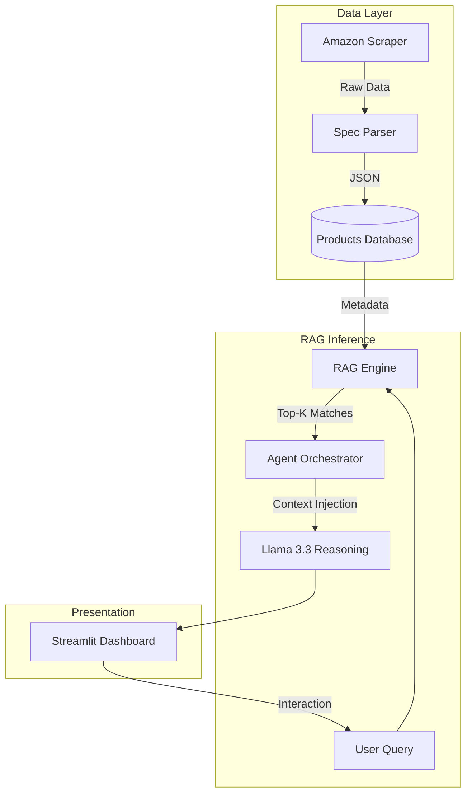

# 💻 AI-Powered Laptop Recommendation System

### *Intelligent Shopping Consultant using RAG & Agentic AI*


[](https://www.python.org/)

[](https://streamlit.io/)

[](https://langchain.com/)

[](https://github.com/facebookresearch/faiss)


---


## 📺 Demo 

Watch the system in action and explore the test plan execution:


> [!TIP]

> **[https://youtu.be/Rl3DawK-n4c]**


---


## 🌟 Overview

This project is a **full-stack Recommendation Engine** that transforms raw e-commerce data into personalized laptop suggestions. Using **Retrieval-Augmented Generation (RAG)**, it interprets technical specifications (CPU, GPU, RAM, etc.) to provide **context-aware recommendations**, rather than simple keyword matching.


---


## 🏛 Architecture

Modular and scalable architecture separates data, reasoning, and presentation layers.


### 🔄 Execution Pipeline




---


## 📁 Project Structure 


### 🌳 File Hierarchy

```text

laptop-recommendation-system/

├── .gitignore          # Files to ignore in Git

├── api.env             # Local Environment Variables (API Keys)

├── app.py              # Main Streamlit Dashboard UI

├── agent_system.py     # LangGraph Agent Orchestration

├── config.py           # Project Global Configurations

├── dataset_loader.py   # JSON Data Processing Utility

├── rag_engine.py       # FAISS Vector Search & RAG Logic

├── scraper.py          # Selenium Web Scraper for Amazon

└── requirements.txt    # Project Dependencies

```


### 📄 Module Responsibilities

| Module | Responsibility |

| :--- | :--- |

| **`app.py`** | Streamlit dashboard and chat interface management. |

| **`agent_system.py`** | Orchestrates the agent workflow using **LangGraph**. |

| **`scraper.py`** | Selenium-based laptop data scraper with dynamic parsing. |

| **`rag_engine.py`** | FAISS-powered semantic search engine using MiniLM embeddings. |

| **`config.py`** | Environment variables and hyperparameter settings. |


---


## 🛠 Key Features

* **Semantic Reasoning:** Understands complex queries like *"Laptop for heavy video editing"* by mapping specs to performance tiers.

* **Stateful Agent Flow:** Uses a structured graph to ensure logical transitions between data retrieval and AI responses.

* **Structured Spec Parsing:** Advanced Regex logic converts unstructured product titles into clean, searchable specs.

* **Vectorized Search:** Uses `all-MiniLM-L6-v2` embeddings for high-speed similarity matching.


---


## 🚀 Roadmap

- [ ] **Comparative Analysis Mode:** AI-driven side-by-side spec comparisons.

- [ ] **Price Tracking:** Historical price charts and "Best Deal" alerts.

- [ ] **Multimodal Search:** Capability to search for laptops via image-based queries.


---


## ⚙️ Quick Start


### 1. Clone & Install

```bash

git clone [https://github.com/Youssef-Al-eng/laptop-recommendation-system.git](https://github.com/Youssef-Al-eng/laptop-recommendation-system.git)

cd laptop-recommendation-system

pip install -r requirements.txt

```


### 2. Environment Setup

Create a file named `api.env` in the root directory:

```env

GROQ_API_KEY=your_key_here

```


### 3. Run Ingestion & App

```bash

# First, scrape the latest data

python scraper.py


# Then, launch the dashboard

streamlit run app.py

```


---

**Developed by [Youssef Alaa](https://github.com/Youssef-Al-eng)** *Passionate about AI Engineering & Scalable Software Solutions.*

